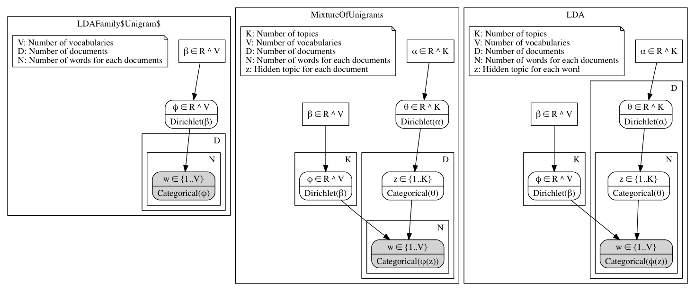

# Platebuilder: Typesafe plate notation (graphical model) builder

Typesafe Scala DSL to build graphical model.



```scala
  val Unigram = Model.define("Unigram") { implicit ctx =>
    import ctx.dsl._
    val V = size("V") // num of vocabularies
    val D = size("D") // num of documens
    val N = size("N") * D // N(d): num of words in document d

    // hyperparameters
    val beta = given("β").realVec(V)

    // variables
    val phi = hidden("φ").realVec(V)
    val w = observed("w").category(V) * (D, N)

    phi ~ dirichlet(beta)

    for (d <- D) {
      for (n <- N(d)) {
        w(d, n) ~ multinominal(phi)
      }
    }
  }

  val MixtureOfUnigrams = Model.define("MixtureOfUnigrams") { implicit ctx =>
    import ctx.dsl._
    val K = size("K") // num of topics
    val V = size("V") // num of vocabularies
    val D = size("D") // num of documens
    val N = size("N") * D // N(d): num of words in document d

    // hyperparameters
    val alpha = given("α").realVec(K)
    val beta = given("β").realVec(V)

    // variables
    val phi = hidden("φ").realVec(V) * K
    val theta = hidden("θ").realVec(K)
    val z = hidden("z").category(K) * D
    val w = observed("w").category(V) * (D, N)

    for (k <- K) {
      phi(k) ~ dirichlet(beta)
    }

    theta ~ dirichlet(alpha)

    for (d <- D) {
      z(d) ~ multinominal(theta)
      for (n <- N(d)) {
        w(d, n) ~ multinominal(phi(z(d)))
      }
    }
  }

  val LDA = Model.define("LDA") { implicit ctx =>
    import ctx.dsl._
    val K = size("K") // num of topics
    val V = size("V") // num of vocabularies
    val D = size("D") // num of documens
    val N = size("N") * D // N(d): num of words in document d

    // hyperparameters
    val alpha = given("α").realVec(K)
    val beta = given("β").realVec(V)

    // variables
    val phi = hidden("φ").realVec(V) * K
    val theta = hidden("θ").realVec(K) * D
    val z = hidden("z").category(K) * (D, N)
    val w = observed("w").category(V) * (D, N)

    for (k <- K) {
      phi(k) ~ dirichlet(beta)
    }

    for (d <- D) {
      theta(d) ~ dirichlet(alpha)
      for (n <- N(d)) {
        z(d, n) ~ multinominal(theta(d))
        w(d, n) ~ multinominal(phi(z(d, n)))
      }
    }
  }

  val models = Seq(Unigram, MixtureOfUnigrams, LDA)

  println(Model.toDot(models))
```
